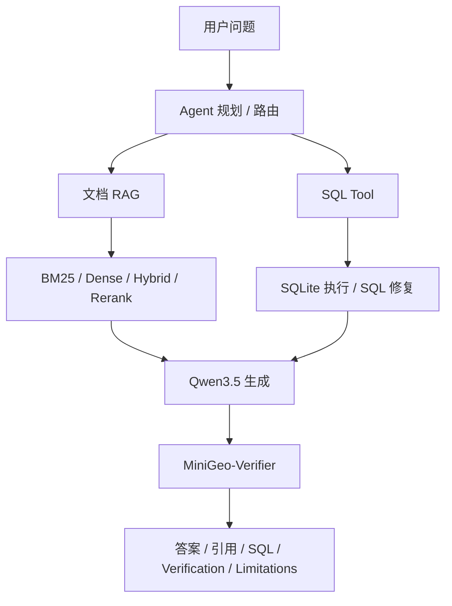

# MiniGeo

<div align="center">

**Geoscience-grounded RAG, Verifier, and SQL Agent system built around Qwen3.5**

[](#封档状态)
[](docs/benchmark.md)
[](results/main_results.md)
[](docs/architecture.md)
[](docs/agent-design.md)

</div>

MiniGeo 是一个基于 Qwen3.5 的地学可信问答与数据分析 Agent 项目。项目目标不是训练新的地学基础模型，而是构建一个可评测、可复查、可解释的领域系统：MiniGeo-Bench、公开资料 RAG corpus、混合检索、引用约束、证据 Verifier、QLoRA/SFT smoke、SQL 工具和文档 + 数据库混合 Agent。

## 封档状态

当前仓库已作为 **展示版封档**：

- 本地验收通过：`results/local_audit.md` 记录 `166 passed`。
- 发布清单通过：`results/release_checklist.md` 记录 `ready_items=10`、`incomplete_items=0`、`missing_items=0`。
- A100 final smoke 已接入：json64 evidence-conditioned SFT smoke 达到 `citation_hit_rate=1.000`、`abstention_accuracy=1.000`、`thinking_raw_outputs=0/10`。
- 已知边界清楚记录：final smoke 仍有 `1/10 malformed raw JSON`，因此不安排 553step 或 1 epoch 长训。
- 当前策略：冻结展示版；后续只有在专门修复 malformed JSON 格式样本时，才考虑重新开短 smoke。

## 当前状态

MiniGeo 已完成一个可展示的研究型闭环：

| 模块 | 当前状态 | 入口 |
|---|---|---|
| Benchmark | 300 条 UTF-8 中文 MiniGeo-Bench，209 条带 evidence label，60 条 SQL 题 | `data/benchmark/minigeo_bench.jsonl` |
| RAG corpus | 42 个稳定 `chunk_id`，非 system chunk 已绑定公开来源 URL | `data/processed/rag_corpus.jsonl` |
| Retrieval | BM25、dense、hybrid、hybrid+rerank，含真实 Qwen3-Embedding/Reranker staged run | `results/retrieval_service_eval.md` |
| Generation | OpenAI-compatible Qwen 服务客户端和 RAG 生成链路 | `src/minigeo/llm/`、`src/minigeo/rag/` |
| Verifier | claim 抽取、证据匹配、支持性分类、拒答/改写记录 | `src/minigeo/verifier/` |
| SQL Agent | SQLite demo DB、SQL 生成、SQL repair、Agent report | `src/minigeo/sql/`、`src/minigeo/agent/` |
| SFT smoke | Qwen3.5-2B LoRA adapter smoke 与 json64 evidence final smoke | `results/sft_adapter_json64_evidence_eval.md` |
| Release audit | 本地测试、数据质量、展示材料和发布清单一键验收 | `scripts/audit_project.py` |

## 关键结果

完整主表见 `results/main_results.md`。

| System / Module | Key metric | Result |
|---|---:|---|
| Qwen3.5-4B no-RAG | Citation Hit | 0.000 |
| Qwen3.5-4B + BM25 RAG | Citation Hit | 0.689 |
| Qwen3.5-4B + BM25 RAG + Verifier | Unsupported Claim | 0.023 |
| Qwen3-Embedding-0.6B dense retrieval | Citation Hit | 0.957 |
| Qwen3-Embedding-0.6B hybrid retrieval | Citation Hit | 1.000 |
| Qwen3-Reranker-0.6B hybrid rerank | Citation Hit | 0.995 |
| MiniGeo-2B-SFT json64 evidence smoke | Citation Hit / Abstention | 1.000 / 1.000 |
| SQL rule baseline | SQL Exec | 1.000 |
| MiniGeo-Agent multi-case | Pass Rate | 1.000 |

SFT final smoke 的结论是：evidence-conditioned prompt 能恢复 citation/refusal 行为，且尾部污染降到 0/10；但 raw JSON 仍有 1/10 malformed，因此展示版不继续扩大训练。

## 系统架构



核心公共接口保持稳定：

- Benchmark item：`id/question/answer/type/difficulty/answerable/requires_sql/evidence`
- Corpus chunk：`chunk_id/doc_id/text/source/url/topic/mineral/license`
- RAG answer：`answer/citations/abstained/confidence`
- Verifier report：`verdict/claims`
- SQL tool result：`question/schema/sql/execution_result/error`
- Agent final report：`answer/sql/evidence/verification/limitations`

## 展示材料

| 材料 | 文件 |
|---|---|
| 展示版总览 | `docs/project-showcase.md` |
| 架构说明 | `docs/architecture.md` |
| Agent 设计 | `docs/agent-design.md` |
| Benchmark 规则 | `docs/benchmark.md` |
| Data card | `docs/data-card.md` |
| 主结果表 | `results/main_results.md` |
| 失败案例 | `results/failure_cases.md` |
| SFT evidence final smoke | `results/sft_adapter_json64_evidence_eval.md` |
| 发布验收清单 | `results/release_checklist.md` |

## 快速开始与运行方式

本地开发只需要 dev 依赖：

```powershell
python -m venv .venv
.\.venv\Scripts\Activate.ps1
python -m pip install --upgrade pip
python -m pip install -r requirements-dev.txt
python -m pytest -q
```

`requirements.txt` / `requirements-model.txt` 包含 torch、transformers、gradio、Pillow 等重型模型依赖，建议在 Python 3.10-3.12 或 Colab Pro 中安装，不建议在 Windows + Python 3.14 上一次性安装。

## 一键验收

```powershell
python scripts/audit_project.py
```

该命令会依次运行单元测试、benchmark 分布统计、检索消融、Verifier 评测、SQL 评测、Agent 多案例评测、SFT 数据构建、本地结果摘要和发布验收清单，并写入：

- `results/local_audit.md`
- `results/release_checklist.md`

## 常用命令

```powershell
python scripts/evaluate_bench.py
python scripts/evaluate_retrieval_ablation.py
python scripts/analyze_retrieval_failures.py
python scripts/evaluate_abstention.py
python scripts/evaluate_verifier.py
python scripts/evaluate_sql.py
python scripts/evaluate_agent_planner.py
python scripts/evaluate_agent_cases.py
python scripts/build_sft_corpus.py
python scripts/audit_data_quality.py
python scripts/write_report_artifacts.py
python scripts/write_release_checklist.py
python scripts/agent_demo.py
```

模型服务相关脚本使用 OpenAI-compatible endpoint：

```powershell
$env:OPENAI_BASE_URL="http://localhost:8000/v1"
$env:OPENAI_API_KEY="EMPTY"
$env:MINIGEO_MODEL="Qwen/Qwen3.5-2B"
python scripts/model_rag_demo.py
```

环境变量示例见 `configs/model_service.example.env`。Colab 和 A100 runbook 仍保留在 `docs/` 中用于复现实验，但封档后默认不再安排新训练。

## 数据与版权策略

- 只提交公开资料 metadata、处理脚本和 seed corpus。
- 不提交版权不明确的原始 PDF。
- 非 system chunk 保留 `source/url/page/topic/mineral/license`。
- SFT corpus 使用 `reference_answer_leaks=[]` 作为硬门槛。
- MiniGeo-Bench reference answer 不直接进入 SFT 输出训练。

## 已知边界

- 当前 RAG corpus 是 seed 规模，适合展示系统闭环，不代表完整地学知识库。
- 真实 Qwen3.5-4B RAG 结果仍有 citation miss，详见 `results/failure_cases.md`。
- json64 SFT evidence final smoke 指标恢复，但仍有 `minigeo_009` 的 malformed raw JSON。
- QLoRA/SFT 是增强项，不是主贡献；主贡献是可评测的地学可信 RAG + Verifier + Agent 系统。

## 项目定位

MiniGeo 研究的是：轻量 Qwen3.5 系统能否通过领域 RAG、引用验证和 Agent 数据分析提高地学问答可靠性，而不是单纯依赖模型规模。
