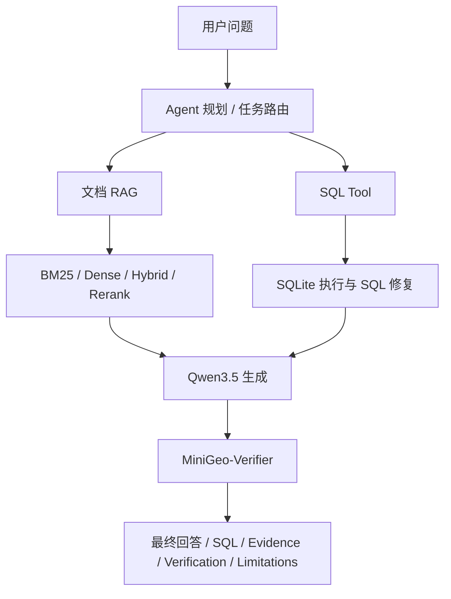

# MiniGeo 展示版总览

## 项目定位

MiniGeo 是一个基于 Qwen3.5 的地学可信问答与数据分析 Agent 系统。项目重点不是训练新的大模型，而是把地学 benchmark、可追踪 RAG corpus、引用约束、Verifier、SQL 工具和 Agent 报告链路组织成可评测系统。

当前展示口径：

- 300 条 MiniGeo-Bench 种子评测集，其中 209 条带 evidence label，60 条需要 SQL。
- 42 个可追踪 seed corpus chunk，非 system chunk 已绑定公开来源 URL。
- 本地 BM25、dense、hybrid、hybrid+rerank 消融已经可复现。
- 真实 `Qwen/Qwen3-Embedding-0.6B` 和 `Qwen/Qwen3-Reranker-0.6B` staged 服务消融已经完成。
- Qwen3.5-4B RAG/no-RAG、RAG + Verifier、模型辅助 Verifier、SQL generator 和 Agent demo 已入主结果表。

## 架构摘要



## 当前关键结果

| 模块 | 当前结果 | 说明 |
|---|---:|---|
| BM25 RAG baseline | citation_hit_rate=1.000 | 当前 seed corpus 上最稳 |
| Qwen3-Embedding-0.6B dense retrieval | citation_hit_rate=0.957 | 真实 embedding staged run |
| Qwen3-Embedding-0.6B hybrid retrieval | citation_hit_rate=1.000 | 与 BM25 持平，可作为补充通道 |
| Hybrid + local lexical rerank | citation_hit_rate=0.900 | 本地 lexical reranker 会拉低结果 |
| Qwen3-Reranker-0.6B hybrid rerank | citation_hit_rate=0.995 | 真实 reranker staged run |
| Qwen3.5-4B + BM25 RAG | citation_hit_rate=0.689 | 真实模型服务输出 |
| Qwen3.5-4B SQL generator | sql_exec_accuracy=1.000 | 60 条 SQL benchmark |
| QLoRA smoke run | 5 steps completed | Colab A100，adapter 已本地归档 |
| QLoRA 128 step run | adapter generated | Colab A100，128step adapter 已通过 artifact 检查 |
| MiniGeo-2B-SFT 128step smoke | citation_hit_rate=0.111 | adapter 可加载但格式和引用仍不稳定 |
| QLoRA 1 epoch artifact | not completed | 2026-05-05 下载包未包含 1 epoch adapter |
| Planner baseline | routing_accuracy=1.000 | 规则型 planner |
| MiniGeo-Agent 多案例评测 | pass_rate=1.000 | 覆盖 hybrid / sql / docs 三类本地回归 |

完整表见 `results/main_results.md`。

## 检索失败分析

检索失败分析见 `results/retrieval_failure_analysis.md`。

当前结论：

- BM25 和 hybrid 在 209 条 evidence-labeled 题目的 top-10 上没有 miss。
- dense retrieval 的 miss 主要来自 `evidence_label_narrow` 和 `same_topic_wrong_chunk`，说明有些 retrieved chunk 可能同样可支撑答案，需要人工复核 label。
- hybrid+local lexical rerank 的 25 个 miss 全部是 `reranker_demoted_gold`，说明当前本地 lexical reranker 不应作为最终主系统。
- 真实 `Qwen3-Reranker-0.6B` staged run 已把 hybrid rerank 的 citation hit 提升到 0.995，基本解决 local reranker 的降排问题。

## 当前可展示 Demo 与回归

最终 Agent demo 问题：

```text
Analyze which mineral categories are most frequently misclassified in samples collected from Qinhuangdao, and explain possible causes using spectral evidence.
```

输出包含：

- SQL 查询。
- SQL 执行结果。
- 文档 evidence。
- Verification report。
- Limitations。

多案例本地评测已经覆盖：

- `hybrid`：秦皇岛误判类别统计 + 光谱证据解释。
- `sql`：按地区统计错误预测数量。
- `docs`：石英拉曼光谱证据问答。

结果见 `results/agent_cases.md`。

设计说明见 `docs/agent-design.md`。

## 剩余任务

不需要 A100 的核心工程链路已经基本收敛，真实 reranker staged 消融、QLoRA smoke run、SFT corpus 扩充和 Agent 多案例本地评测也已完成。2026-05-05 下载的 128step Colab artifact 已确认包含 `adapter_model.safetensors`，并已完成 smoke10 推理；但 smoke10 暴露出 `</think>` 泄漏、多 JSON 输出和 citation 格式不稳，1 epoch artifact 仍未生成。后续主要剩余任务：

1. 改进 SFT 推理 prompt/parser，处理多 JSON 输出、`</think>` 泄漏和非标准 citation。
2. 补 `Qwen/Qwen3.5-2B` base 模型同 10 题对照。
3. 如果格式和引用行为改善，再重新运行并打包 553step 或 1 epoch 小规模 SFT。

SFT adapter 评测流程见 `docs/sft-adapter-eval-runbook.md`。

## 简历表述

MiniGeo：构建基于 Qwen3.5 的地学可信问答与数据分析 Agent 系统，包含 300 条领域 benchmark、可追踪 RAG corpus、BM25/embedding/hybrid/reranker 检索消融、证据 Verifier、Text-to-SQL 工具和混合文档 + 数据库 Agent demo；在真实 Qwen3-Embedding 与 Qwen3-Reranker 服务上完成 staged retrieval evaluation，并跑通 Qwen3.5-2B QLoRA smoke training，通过 citation hit、unsupported claim、abstention、SQL execution accuracy 和 latency 形成可复现实验闭环。
